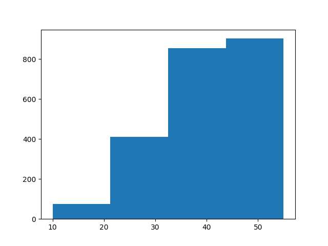

# Descoberta de Conhecimento em Python

Este repositório faz referência à um trabalho sobre KDD (Knowledge Discovery in Databases) da disciplina de Banco de Dados II. Durante o trabalho foram abordadas todas as etapas de KDD, tendo como base de dados um arquivo com pedidos de uma pizzaria.


<h2> Banco de Dados </h2>

SQL para criação do banco pizzaria e da tabela pedidos_full. Os dados podem ser importados através do <b>.csv</b> disponibilizado na pasta <b>selecao</b> ou através do SQL de inserção contido do arquivo <b>database.sql.</b>

```
CREATE DATABASE  IF NOT EXISTS `pizzaria`;
USE `pizzaria`;

--
-- Table structure for table `pedidos`
--

DROP TABLE IF EXISTS `pedidos_full`;

CREATE TABLE `pedidos_full` (
  `numero` int(11) NOT NULL,
  `data_pedido` date DEFAULT NULL,
  `hora_pedido` time DEFAULT NULL,
  `cliente` varchar(20) DEFAULT NULL,
  `endereco` varchar(20) DEFAULT NULL,
  `telefone` varchar(20) DEFAULT NULL,
  `tipo_entrega` varchar(20) DEFAULT NULL,
  `valor_pizza` float DEFAULT NULL,
  `valor_borda` float DEFAULT NULL,
  `valor_refrigerante` float DEFAULT NULL,
  `valor_entrega` float DEFAULT NULL,
  `valor_total` float DEFAULT NULL,
  `hora_entrega` time DEFAULT NULL,
  `tempo` time DEFAULT NULL,
  PRIMARY KEY (`numero`)
) ENGINE=InnoDB DEFAULT CHARSET=utf8;

```

<h2>Transformação e Limpeza dos Dados</h2>
Para algumas funções foi necessário antes codificar em python histogramas que representassem intervalos definidos. Esses histogramas foram gerados com auxílio da biblioteca matplotlib.

```
#código Python para criação de histogramas
dados = np.genfromtxt('tempo_decorrido.csv')
histograma = plt.hist(dados, bins="scott")
#histograma = plt.hist(dados, bins=4)
plt.show()
```



```
/*transforma tempo*/
DELIMITER $$
CREATE FUNCTION transforma_tempo(tempo time) 
RETURNS varchar(20)
BEGIN
    DECLARE tempo2 varchar(20);
    IF(tempo >= '00:10:00' AND tempo <= '00:22:00') THEN
        SET tempo2 = 'tp 10-22';
    ELSEIF(tempo > '00:22:00' AND tempo <= '00:32:00') THEN
        SET tempo2 = 'tp 22-33';
    ELSEIF(tempo > '00:32:00' AND tempo <= '00:43:00') THEN
        SET tempo2 = 'tp 33-44';
    ELSEIF(tempo > '00:43:00' AND tempo <= '00:55:00') THEN
        SET tempo2 = 'tp 44-55';

    END IF;
    RETURN tempo2;
END $$
DELIMITER;

```
As demais funções podem ser verificadas no arquivo comandos.sql na pasta <i>transformacao</i>

<h2> Algoritmo Apriori</h2>

Para a execução do algoritmo apriori foi necessário exportar uma seleção geral com as funções que foram implementadas;
```
SELECT transforma_data(data_pedido), transforma_hora(hora_pedido), tipo_entrega, transforma_borda(valor_borda), transforma_refrigerante(valor_refrigerante), transforma_valor(valor_total), transforma_tempo(tempo) FROM pedidos_full;

```

Após isso, bastou codificar o algoritmo utilizando o pandas.
```
#importação de bibliotecas
import numpy as np
import matplotlib.pyplot as plt
import pandas as pd #biblioteca para análise de dados
from apyori import apriori #implementação do algoritmo apriori

#importa o arquivo csv
dados = pd.read_csv('pizzaria.csv', header=None) #comando para ler o arquivo csv
qtd = len(dados) #quantidade de registros

registros = [] #cria uma estrutura de lista chamada registros

#laço de repetição para adicionar os dados na lista de registros
for i in range(0, qtd): #laço de repetição de com intervalo de 0 a qtd-1
    registros.append([str(dados.values[i, j]) for j in range (0, 7)]) #adiciona na lista cada elemento de cada registro 
        
#criando regras de associação
#associacoes recebe a aplicação da função apriori sobre os registros, com o mínimo de suporte, confiança, lift e comprimento definidos    
associacoes = apriori(registros, min_support = 0.0053, min_confidence =0.20, min_lift=5, min_lenght=2 )
resultado_associacoes = list(associacoes) #transforma as associacoes em uma lista

resultado_final = []

#laço de repeticao de cada item de resultados
for item in resultado_associacoes:
    par = item[0] #recebe o item na posicao 0
    itens = [i for i in par] #itens recebe x para cada x no par
    
    value0 = str(itens[0]) #item 1
    value1 = str(itens[1]) #item 2
    value2 = str(item[1])[:7] #suporte fatiando na 7ºposição
    value3 = str(item[2][0][2])[:7] #confianca fatiando na 7º posição
    value4 = str(item[2][0][3])[:7] #lift fatiando na 7º posição
    
    linhas = (value0, value1, value2, value3, value4) #linha recebe os valores
    
    resultado_final.append(linhas) #adiciona no resultado final
    
    Label = ['Item 1', 'Item 2', 'Suporte', 'Confiança', 'Lift']
    
    #a cada iteração do laço, sugestão aumentará, pois a lista resultado_final ficará maior
    sugestao = pd.DataFrame.from_records(resultado_final, columns=Label) #constroi as tuplas
    
    print (sugestao)
```


