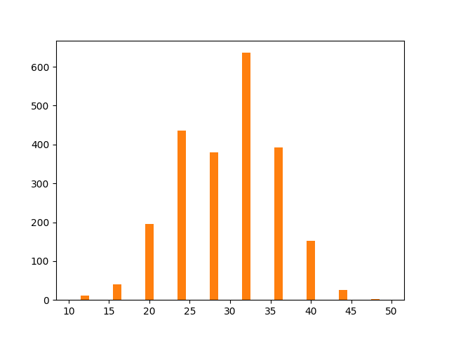

# Descoberta de Conhecimento com Python

Este repositório faz referência à um trabalho sobre KDD (Knowledge Discovery in Databases) da disciplina de Banco de Dados II. Durante o trabalho foram abordadas todas as etapas de KDD, tendo como base de dados um arquivo com pedidos de uma pizzaria.


<h2> Seleção do Banco de Dados </h2>

SQL para criação do banco pizzaria e da tabela pedidos_full. Os dados para inserção podem ser importados através do <b>.csv</b> disponibilizado na pasta <b>selecao</b> ou através do SQL de inserção contido do arquivo <b>database.sql.</b>

```
CREATE DATABASE  IF NOT EXISTS `pizzaria`;
USE `pizzaria`;

--
-- Table structure for table `pedidos`
--

DROP TABLE IF EXISTS `pedidos_full`;

CREATE TABLE `pedidos_full` (
  `numero` int(11) NOT NULL,
  `data_pedido` date DEFAULT NULL,
  `hora_pedido` time DEFAULT NULL,
  `cliente` varchar(20) DEFAULT NULL,
  `endereco` varchar(20) DEFAULT NULL,
  `telefone` varchar(20) DEFAULT NULL,
  `tipo_entrega` varchar(20) DEFAULT NULL,
  `valor_pizza` float DEFAULT NULL,
  `valor_borda` float DEFAULT NULL,
  `valor_refrigerante` float DEFAULT NULL,
  `valor_entrega` float DEFAULT NULL,
  `valor_total` float DEFAULT NULL,
  `hora_entrega` time DEFAULT NULL,
  `tempo` time DEFAULT NULL,
  PRIMARY KEY (`numero`)
) ENGINE=InnoDB DEFAULT CHARSET=utf8;

```
<h2> Transformação dos Dados </h2>

<b>Descarte de colunas inutilizáveis</b>

```
ALTER TABLE pedidos_full DROP COLUMN numero;
ALTER TABLE pedidos_full DROP COLUMN cliente;
ALTER TABLE pedidos_full DROP COLUMN endereco;
ALTER TABLE pedidos_full DROP COLUMN telefone;
ALTER TABLE pedidos_full DROP COLUMN valor_pizza;
ALTER TABLE pedidos_full DROP COLUMN valor_entrega;
ALTER TABLE pedidos_full DROP COLUMN hora_entrega;
```

<b>Histogramas gerados para função de transformação das colunas tempo_pedido e valor_pedido</b><br>




```
DELIMITER $$
CREATE FUNCTION transforma_tempo(tempo time) 
RETURNS varchar(20)
BEGIN
    DECLARE tempo2 varchar(20);
    IF(tempo >= '00:10:00' AND tempo <= '00:22:00') THEN
        SET tempo2 = 'tp 10-22';
    ELSEIF(tempo > '00:22:00' AND tempo <= '00:32:00') THEN
        SET tempo2 = 'tp 22-33';
    ELSEIF(tempo > '00:32:00' AND tempo <= '00:43:00') THEN
        SET tempo2 = 'tp 33-44';
    ELSEIF(tempo > '00:43:00' AND tempo <= '00:55:00') THEN
        SET tempo2 = 'tp 44-55';

    END IF;
    RETURN tempo2;
END $$
DELIMITER;
```

```
/*transforma valor*/
DELIMITER $$
CREATE FUNCTION transforma_valor(valor_total float) 
RETURNS varchar(20)

BEGIN
    DECLARE preco varchar(20);
    IF(valor_total>= 10 AND valor_total <= 13) THEN
        SET preco = 'vl 10-13';
    ELSEIF(valor_total> 13 AND valor_total <= 16) THEN
        SET preco = 'vl 13-16';
    ELSEIF(valor_total> 16 AND valor_total <= 20) THEN
        SET preco = 'vl 16-20';
    ELSEIF(valor_total> 20 AND valor_total <= 24) THEN
        SET preco = 'vl 20-24';
    ELSEIF(valor_total> 24 AND valor_total <= 28) THEN
        SET preco = 'vl 24-28';    
    ELSEIF(valor_total> 28 AND valor_total <= 32) THEN
        SET preco = 'vl 28-32'; 
    ELSEIF(valor_total> 32 AND valor_total <= 36) THEN
        SET preco = 'vl 32-36';
    ELSEIF(valor_total> 36 AND valor_total <= 40) THEN
        SET preco = 'vl 36-40';
    ELSEIF(valor_total> 40 AND valor_total <= 44) THEN
        SET preco = 'vl 40-44';
    ELSEIF(valor_total> 44 AND valor_total <= 50) THEN
        SET preco = 'vl 44-50';
    END IF;
    RETURN preco;

END $$

delimiter;
```

<b>Outras funções criadas:</b>

```

/*transforma data*/
delimiter $$
CREATE FUNCTION transforma_data(data_pedido date) 
RETURNS varchar(20)

 BEGIN
    DECLARE dia varchar(20);
    if(dayofweek(data_pedido) = 1) THEN
        set dia = 'Domingo';
    ELSEIF(dayofweek(data_pedido) = 2) THEN
        set dia = 'Segunda';
    ELSEIF(dayofweek(data_pedido) = 3) THEN
        set dia = 'Terça';
    ELSEIF(dayofweek(data_pedido) = 4) THEN
        set dia = 'Quarta';
    ELSEIF(dayofweek(data_pedido) = 5) THEN
        set dia = 'Quinta';
    ELSEIF(dayofweek(data_pedido) = 6) THEN
        set dia = 'Sexta';    
    ELSEIF(dayofweek(data_pedido) = 7) THEN
        set dia = 'Sábado';
    end IF;

    RETURN dia;

END $$

delimiter;
```

```

/*transforma hora*/
delimiter $$
CREATE FUNCTION transforma_hora(hora_pedido time) 
RETURNS varchar(20)

 BEGIN
    DECLARE periodo varchar(20);
    if(hora_pedido < '20:00:00') THEN
        set periodo = 'Inicio';
    ELSEIF(hora_pedido >= '20:00:00' and hora_pedido < '22:00:00') THEN
        set periodo = 'Pico';
    ELSEIF(hora_pedido >= '22:00:00') THEN
        set periodo = 'Final';
    end IF;

    RETURN periodo;

END $$

delimiter;
```

```

/*transforma borda*/
DELIMITER $$
CREATE FUNCTION transforma_borda(valor_borda float) 
RETURNS varchar(20)

BEGIN
    
	DECLARE borda varchar(20);
    if(valor_borda > 0) THEN
        set borda = 'Borda sim';
    ELSEIF(valor_borda <=0) THEN
        set borda = 'Borda não';
    end IF;

    RETURN borda;


END $$

delimiter;
```
```
/*transforma refrigerante*/
DELIMITER $$
CREATE FUNCTION transforma_refrigerante(valor_refrigerante float) 
RETURNS varchar(20)

BEGIN
    
	DECLARE refrigerante varchar(20);
    if(valor_refrigerante > 0) THEN
        set refrigerante = 'Refrigerante sim';
    ELSEIF(valor_refrigerante <=0) THEN
        set refrigerante = 'Refrigerante não';
    end IF;

    RETURN refrigerante;


END $$

delimiter;
```


